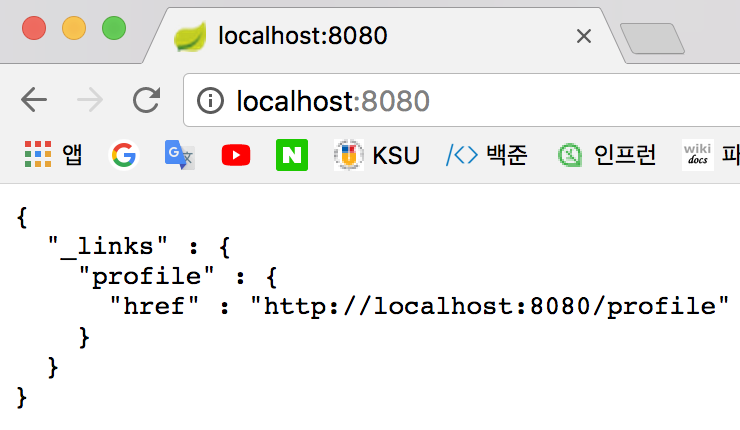
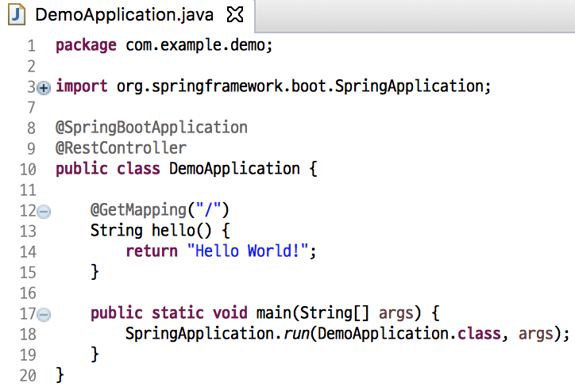
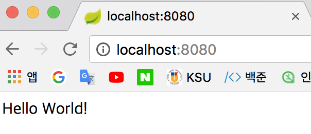

# Ch.1(2018. 03. 13)

----

## Index
1. 통합개발 도구설정
2. 스프링 부트 프로젝트의 실행과 테스트

----

### 1. 통합개발 도구설정
1. JDK 1.8 다운로드(http://www.oracle.com/technetwork/java/javase/downloads/jdk8-downloads-2133151.html)

2. STS 다운로드(https://spring.io/tools/sts/all)

3. 개발환경 설정
    - 문자셋(UTF-8) 설정 : General -> worksapce[UTF-8]
    - 폰트 설정 : General -> Apperance -> Colors and Fonts -> Basic -> Text Editor Block Selection Font, Text Font
    - 라인넘버 설정 : General -> Editors -> Text Editors -> Show line numbers

4. 스프링 부트 환경설정
    - Servers -> pivotal 삭제
    - file -> new -> Spring start Project
      1. Service URL, Name : 유지
      2. Type : Maven
      3. Packaging : Jar
      4. Java Version : 8
      5. Language : java
      6. Group, Artifact, Version, Description, Package : 유지
      7. next
      8. Spring Boot Version : 2.0.0
      9. Available -> Web -> Rest Repositories
      10. Available -> SQL -> JPA, H2
      11. Finish
---

### 2. 스프링 부트 프로젝트의 실행과 테스트
1. 기본 프로젝트 실행(demo -> 우클릭 -> Run as -> Spring Boot App)
2. Chrome : [url] localhost:8080
    - 
3. "Hello World" 출력하기
    - demo -> src/main/java/com.example.demom/DemoApplication.java
    - 코드작성 
    - 이전에 실행했던 서버 Shutdown
    - 재실행(demo -> 우클릭 -> Run as -> Spring Boot App)
    - Chrome
        - [url] localhost:8080 
---
