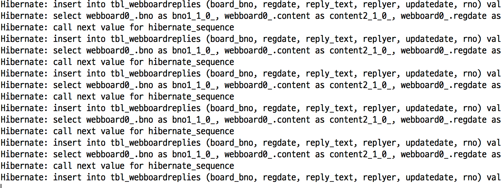

# CH.10(2018. 06. 05)

## 11주차
- 게시판에 댓글 달기(내부구현)
- 데이터베이스 관계 설정(1:N)
- 데이터베이스 초기 데이터 삽입

#### 1. [데이터베이스 관계 설정(1:N) 모델링](https://github.com/sigmadream/ks-springboot.git)
    board → src/main/java → ks.ac.kr.boardreplay → WebBoardReply.java
- WebBoard : WebBoardReply = 1:N
   - WebBoardReply가 WebBoard에 여러개 삽입 되어야 한다.
   - WebBoard → List\<WebBoardReply\>

#### 2. WebBoard, WebBoardReply - 1:N 관계설정
    board → src/main/java → ks.ac.kr.board → WebBoard.java
- WebBoard에 WebBoardReply 타입의 List생성 - 실행오류
~~~
private List<WebBoardReply> reply;
~~~
- 어노테이션을 이용하여 1:N 관계 설정 - 실행정상
~~~
@OneToMany
private List<WebBoardReply> reply;
~~~
- 어노테이션을 이용하여 N:1 관계 설정 - 실행정상
~~~
board → src/main/java → ks.ac.kr.boardreplay → WebBoardReply.java
~~~
~~~
@ManyToOne
private WebBoard board;
~~~
- 두개의 테이블을 만들었지만 실제로는 세개의 테이블이 생성 (+조인 테이블)
    1. 중간의 조인 테이블이 존재하면 빈번한 참조와 락으로 인하여 느리다.
    2. 해당 테이블을 삭제하고 두개의 테이블을 직접 접근한다.

#### 3. 조인 테이블 삭제 & 테이블 직접연결
- WebBoard → board 컬럼을 이용하여 맵핑 → fetch 설정
    - LAZY(지연연산) - 모든 연산이 한번에 일어나도록 한다.
      - 하나씩 Insert하지 않고 한번에 Insert
      - Delete할 때 전부 지워질 때 까지 대기(부모, 자식)
~~~
board → src/main/java → ks.ac.kr.board → WebBoard.java
~~~
~~~
@OneToMany(mappedBy="board", fetch=FetchType.LAZY)
private List<WebBoardReply> reply;
~~~
- WebBoardReply → fetch 설정
~~~
board → src/main/java → ks.ac.kr.boardreplay → WebBoardReply.java
~~~
~~~
@ManyToOne(fetch=FetchType.LAZY)
private WebBoard board;
~~~
- getter/setter 생성

#### 4. 데이터베이스에 저장하기
    board → src/main/java → ks.ac.ks → DataLoder.java
~~~
@Component
public class DataLoader implements ApplicationRunner {

	@Autowired
    private WebBoardRepository repo;

	@Autowired
	private WebBoardReplyRepository replyRepo;

    @Override
    public void run(ApplicationArguments args) {
    	IntStream.range(0, 100).forEach(i -> repo.save(new WebBoard("title"+i, "content"+i, "user"+(i%10))));
    }

}
~~~
- WebBoardReply에 저장하기(WebBoardReply 생성자 존재X)
~~~
@Override
public void run(ApplicationArguments args) {
  IntStream.range(1, 100).forEach(i -> repo.save(new WebBoard("title"+i, "content"+i, "user"+(i%10))));
  IntStream.range(1, 100).forEach(i -> replyRepo.save(new WebBoardReply());
}
~~~
- WebBoardReply 생성자 생성
~~~
1. board → src/main/java → ks.ac.kr.boardreplay → WebBoardReply.java
2. Source → Generated Construct using Filed → rno, reg, upd 체크해제 → OK
~~~
~~~
public WebBoardReply(String replyText, String replyer, WebBoard board) {
  this.replyText = replyText;
  this.replyer = replyer;
  this.board = board;
}
~~~
- 기본 생성자 추가 생성(관례)
~~~
public WebBoardReply() { }
~~~
- 데이터베이스에 저장하기
~~~
@Override
public void run(ApplicationArguments args) {
  IntStream.range(1, 100).forEach(i -> repo.save(new WebBoard("title"+i, "content"+i, "user"+(i%10))));
  IntStream.range(1, 100).forEach(i -> replyRepo.save(new WebBoardReply("Text" + i, "Replayer" + i, repo.findById((long)i).orElse(null))));
}
~~~
- 실행(webboardreplies 에 저장)

#### 5. WebBoardRepository 설계
      board → src/main/java → kr.ac.ks.boardreplay → WebBoardReplyRepository.java
- Board를 기준으로 업데이트 시간 기준 내림차순으로 찾는다.
~~~
public interface WebBoardReplyRepository extends CrudRepository<WebBoardReply, Long> {

	List<WebBoardReply>findAllByBoardOrderByUpdatedateDesc(WebBoard board);
}
~~~
- 컨트롤러 수정
~~~
board → src/main/java → kr.ac.ks.boardreplay → WebBoardReplyRepository.java
~~~
~~~
  @Autowired
  private WebBoardReplyRepository reply;

    @GetMapping("/{bno}")
    public ResponseEntity<List<WebBoardReply>> getReplies(@PathVariable("bno") Long bno) {
    	WebBoard board = new WebBoard();
    	board.setBno(bno);
        return new ResponseEntity<>(reply.findAllByBoardOrderByUpdatedateDesc(board), HttpStatus.OK);
    }
~~~

## etc
- 프로젝트 : https://github.com/sigmadream/ks-springboot-resume
  1. 프로젝트 불러오기
  2. 학번, 이름, 학과, 주소, 메일주소 삽입
  3. Q&A(추가 점수)
  4. 등록, 수정, 삭제 가능하게 하기 + 모델(1:N) 유지
  5. getter/setter 필수
  6. 초기 데이터 저장 필수(DataLoder.java)
- 댓글창(TREE 구조 만들기) - DB → Join → 알고리즘
  1. 테이블 분해(함수적 종속성 해결)
  2. 테이블 사이의 관계 만들기(1:N) → 본문:댓글 = 1:N
  3. 관계 만들기(자바의 query를 이용하여 관계설계)
- 댓글 화면 보이기
  1. 댓글을 JSON 규격으로 뽑아내기(RestController)
  2. jQuery를 이용하여 JSON을 받아오기
  3. 받아온 JSON을 화면에 그리기
