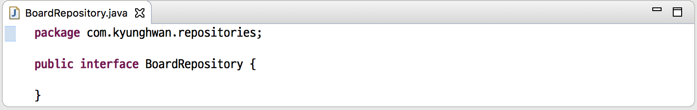
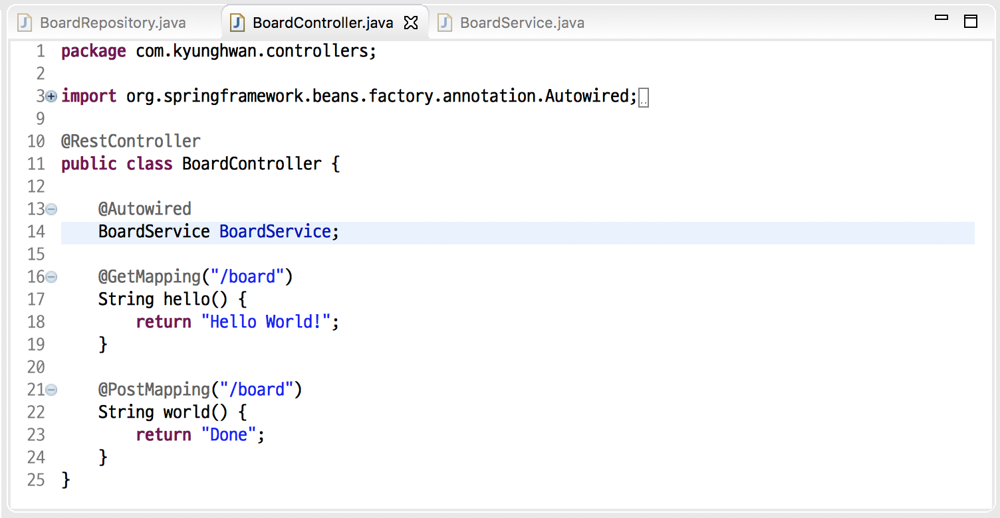

# CH.3(2018. 03. 27)
----

## Index
1. 4주차
2. etc
----

### - 4주차
#### 1. Spring Starter Project 생성
    file -> new -> Spring Starter Project
- 프로젝트 생성

Group, Package : com.이름
- Repository 설정(JPA, Rest, H2)

 

#### 2. 프로젝트 실행확인
    boot02 -> Run As -> Spring Boot App

 

#### 3. 패키지 생성
    controllers, repositories, services, models

- controllers 생성

- repositories, services, models 생성

 

#### 4. 게시판 모델링
    com.kyunghwan.models -> new -> class

- .models 패키지 안 클래스 생성(Board)

- 코드작성

- getter/setter 생성

- toString 생성(StringBuffer/Builder 사용)

 

#### 5. 저장소 생성
    com.kyunghwan.repositories -> new -> interface

- 인터페이스 생성

- 제네릭 타입 상속받기

- 컨테이너, 자료형 수정

 

#### 6. Controller 생성
    com.kyunghwan.controllers -> new -> class

- 클래스 생성

- 코드작성

- BoardRepository와 연결

- 실행(Spring Boot App) 및 테스트(localhost:8080/board)

 

#### 7. Service 클래스 생성
    com.kyunghwan.services -> new -> class

- 클래스 생성(BoardService)

- Writer() 메서드 생성

- BoardController 수정

- 실행(Spring Boot App) 및 테스트(localhost:8080/board)

- BoardRepository 수정

- BoardService Write 메서드 public 지정

- BoardService 내 Read 메서드 생성

- BoardController 내 BoardService형 변수 생성

- 코드작성(board 값 읽어오기)

- 실행(오류)

----

### - etc

#### 반복문
1. for( ; ; ) - 숫자/횟수, 배열의 반복
2. while() - bool 조건
3. do-while() - 초기값의 변경

#### 데이터베이스
1. MVC 모델 개념 배우기
2. 데이터베이스 안에 정보 저장하기
3. 데이터베이스의 정보 빼내기

#### TCP/IP
1. 웹 브라우저 창에 www.naver.com 을 입력한다.
2. 패킷이 실행된다.
3. 패킷이 DNS(Domain Name service)로 입장한다.
4. DNS가 xxx.xxx.xxx.xxx의 IP주소를 준다.
5. IP주소를 보낸다. (라우터 or 스위치 필요)
6. 패킷이 네이버 서버까지 진행된다.
7. 서버에서 Controller가 패킷을 받는다.
    - Controller가 URL을 확인한다.
    - HTTP의 프로토콜을 확인한다(get, post등)
    - Controller가 View를 생성한다.(html)
    - Controller가 DB에 내용을 저장한다.
      - Controller가 DB에 저장할 때 중간에 버퍼(Service)를 둔다.
    - DB의 내용을 Controller가 받는다.
    - Controller가 View와 데이터를 같이 전달한다.
8. 네이버 서버가 브라우저의 HTTP(S)의 응답으로 HTML을 돌려준다.
    - 입력으로 http를 받는다.(http 프로토콜의 method 실행)
    - 출력으로 html을 내보낸다.(예외로 JSON을 보내기도 한다.)

#### GPPPD
1. get : 멱등함수(몇 번을 반복해서 시행해도 같은 결과값이 나오도록 해야하는 메서드) - 해당 결과값을 읽는 용도로만 사용한다.
2. post : html 브라우저에서 실행되지 않기에 html form 태그를 직접 구성하거나 Rest client를 사용하여야 한다.

#### 용어 정리
1. H2
    - Java SQL 데이터베이스
    - 매우 빠른속도 와 오픈소스
    - 임베디드 및 서버모드, 메모리 기반 데이터베이스
    - 브라우저 기반 콘솔응용 프로그램
    - 작은공간 : 약 1.5MB의 jar크기
 

2. JPA
    - Java Persistence API
    - ORM(Object Relationship Mapping)의 표준기술
    - 어플리케이션과 JDBC 사이에서 동작
    - ORM을 인터페이스라고 하였을 때 JPA는 구현기술
 

3. ORM
     - Object Relationship Mapping
     - RDB(관계형 데이터베이스)를 객체지향적으로 사용하게 하는 기술
     - 객체와 테이블을 매핑하여 패러다임의 불일치를 해결
 

4. JDBC
    - Java Database Connectivity
    - 자바에서 데이터베이스에 접속할 수 있도록 하는 자바 인터페이스
 

5. RDB
    - Relational Database
    - 데이터를 구성하는 방법 중 한가지
    - 모든 데이터를 2차원의 테이블 형태로 표현
 

6. @Entity
    - 해당 클래스가 Entity임을 지정하며 테이블과 매핑
    - Entity : 데이터로 관리되어야 하는 항목
 

7. @GeneratedVal
    - 주키의 값을 자동생성
    - generator, strategy
      - strategy : persistence provider가 엔티티의 주키를 생성시 사용
      - generator : 어노테이션에 명시된 주키 생성자를 재사용할 때 사용
    - Auto
      - persistence provider가 특정 DB에 맞게 자동으로 선택
 

8. CrudRepository interface<T, ID>
    - CRUD 기능을 제공하는 interface
    - T : repository가 관리하는 domain 유형
    - ID : repository가 관리하는 Entity ID의 형태
 

9. 제네릭(Generic)
    - 클래스 내부에서 사용할 데이터 타입을 외부에서 지정하는 기법
 

10. @RestController
    - 기존의 controller 처럼 view를 생성하지 않고 데이터 처리를 위한 controller 생성
 

11. @Autowired
    - Spring의 의존성 주입 기능에 의해 자동 생성되도록 생성자, 필드, 설정 메소드 또는 구성 메소드를 표시
 

12. @GetMapping
    - controller 내부에서 URI 경로 지정
    - HTTP GET 요청을 특정 핸들러 메소드에 맵핑하기위한 주석
 

13. @Service
    - Repository를 통해 데이터베이스를 가져온 후 컨트롤러와 연결
----
