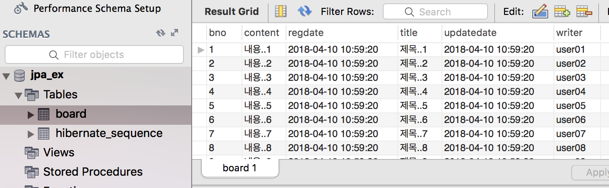
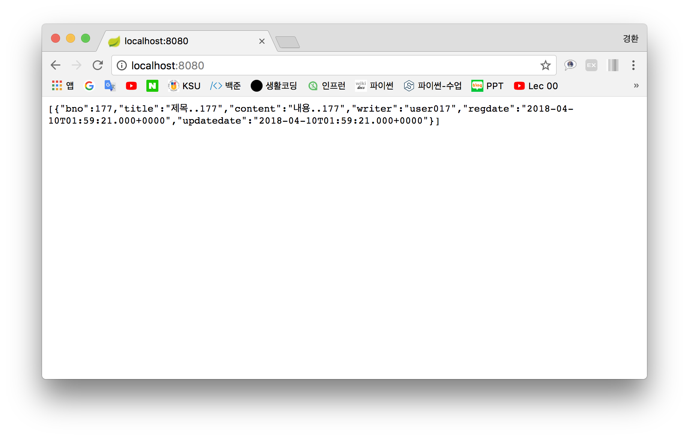

# CH.5(2018. 04. 10)
----

## 6주차

#### 1. 프로젝트 생성
    New → Spring Starter Project
- Name : boot
- Group, Package : com.kyunghwan
- Available : JPA, MySQL, RestRepositories, Thymeleaf, Web

#### 2. 스프링 설정(MySQL, JPA)
    src/main/resources → templates → application.properties
~~~
spring.datasource.driver-class-name=com.mysql.jdbc.Driver
// 스키마
spring.datasource.url=jdbc:mysql://localhost:3306/jpa_ex?useSSL=false
// 계정연동
spring.datasource.username=jpa_user
spring.datasource.password=jpa_user

spring.jpa.hibernate.ddl-auto=update
spring.jpa.generate-ddl=true
spring.jpa.show-sql=true
spring.jpa.database=mysql
spring.jpa.database-platform=org.hibernate.dialect.MySQL5InnoDBDialect

logging.level.org.org.hibernate=info
~~~
- Test : Run As → Spring Boot App → localhost:8080

#### 3. 모델생성(Board)
    Package : src/main/java → new → Package → com.kyunghwan.models
    Class   : com.kyunghwan.models → new → Class → Board
~~~
package com.kyunghwan.models;

import java.sql.Timestamp;

import javax.persistence.Entity;
import javax.persistence.GeneratedValue;
import javax.persistence.GenerationType;
import javax.persistence.Id;

import org.hibernate.annotations.CreationTimestamp;
import org.hibernate.annotations.UpdateTimestamp;

@Entity
public class Board {

	@Id
	@GeneratedValue(strategy=GenerationType.AUTO)
	private Long bno;

	private String title;
	private String content;
	private String writer;

	@CreationTimestamp
	private Timestamp regdate;

	@UpdateTimestamp
	private Timestamp updatedate;
}
~~~
- getter/setter 생성
~~~
Sources → Generated Getter and Setter → Select All → OK
~~~
~~~
public Long getBno() { return bno; }

public void setBno(Long bno) { this.bno = bno; }

public String getTitle() { return title; }

public void setTitle(String title) { this.title = title; }

public String getContent() { return content; }

public void setContent(String content) { this.content = content; }

public String getWriter() { return writer; }

public void setWriter(String writer) { this.writer = writer; }

public Timestamp getRegdate() { return regdate; }

public void setRegdate(Timestamp regdate) { this.regdate = regdate; }

public Timestamp getUpdatedate() { return updatedate; }

public void setUpdatedate(Timestamp updatedate) { this.updatedate = updatedate; }
~~~
- toString() 생성
~~~
Sources → Generated toString() → Code style : Builder/Buffer → OK
~~~
~~~
@Override
public String toString() {
    StringBuilder builder = new StringBuilder();
    builder.append("Board [bno=");
    builder.append(bno);
    builder.append(", title=");
    builder.append(title);
    builder.append(", content=");
    builder.append(content);
    builder.append(", writer=");
    builder.append(writer);
    builder.append(", regdate=");
    builder.append(regdate);
    builder.append(", updatedate=");
    builder.append(updatedate);
    builder.append("]");
    return builder.toString();
}
~~~

#### 4. 저장소 생성(BoardRepository)
    Package   : src/main/java → new → Package → com.kyunghwan.repositories
    Interface : com.kyunghwan.repositories → new → Interface → BoardRepository
- 모델, ID 설정
~~~
package com.kyunghwan.repositories;

import org.springframework.data.repository.CrudRepository;

import com.kyunghwan.models.Board;

public interface BoardRepository extends CrudRepository<Board, Long> {

}
~~~
- Test 코드작성
~~~
src/test/java → com.kyunghwan → Boot03ApplicationTests.java
~~~
~~~
package com.kyunghwan;

import org.junit.Test;
import org.junit.runner.RunWith;
import org.springframework.beans.factory.annotation.Autowired;
import org.springframework.boot.test.context.SpringBootTest;
import org.springframework.test.context.junit4.SpringRunner;

import com.kyunghwan.models.Board;
import com.kyunghwan.repositories.BoardRepository;

@RunWith(SpringRunner.class)
@SpringBootTest
public class BootApplicationTests {

	// 인터페이스 객체를 Spring이 자동으로 생성
	@Autowired
	private BoardRepository boardRepository;

	// 쿼리문 작성
	@Test
	public void testInsert200() {
		for(int i = 1; i <= 200; i++) {
			Board board = new Board();
			board.setTitle("제목.." + i);
			board.setContent("내용.." + i);
			board.setWriter("user0" + (i%20));
			boardRepository.save(board);
		}
	}

	@Test
	public void contextLoads() {
	}
}
~~~
- Test : src/test/java → Run As → JUnit Test
 
- Workbench → board_table 확인

#### 5. 데이터베이스 접근
    src/main/java → com.kyunghwan.repositories → BoardRepository
- SELECT 쿼리 작성(SELECT * / FROM board / Where title = " ")
~~~
package com.kyunghwan.repositories;

import java.util.List;

import org.springframework.data.repository.CrudRepository;

import com.kyunghwan.models.Board;

public interface BoardRepository extends CrudRepository<Board, Long>{

	// 몇 개의 값이 반환될 지 모르기 때문에 List 사용
	// title에 따라 값이 반환
	// 제네릭 타입 Board가 선언 되어있기 때문에 findBoardBy로 작성 하지 않는다.
	List<Board> findByTitle(final String title);
}
~~~

#### 6. 컨트롤러 생성
    Package : src/main/java → new → Package → com.kyunghwan.controllers
    Class   : com.kyunghwan.controllers → new → Class → BoardControl
- "제목..177"값 불러오기
~~~
package com.kyunghwan.controllers;

import java.util.List;

import org.springframework.beans.factory.annotation.Autowired;
import org.springframework.web.bind.annotation.GetMapping;
import org.springframework.web.bind.annotation.RestController;

import com.kyunghwan.models.Board;
import com.kyunghwan.repositories.BoardRepository;

@RestController
public class BoardControl {

	@Autowired
	BoardRepository boardRepository;

	@GetMapping
	public List<Board> getListBoardByTitle(){
		return boardRepository.findByTitle("제목..177");
	}
}
~~~
- 실행 : boot → Run As → Spring boot App
 

- 결과확인 : [url] localhost:8080

----

## etc
- MySQL 서버 실행 → MySQL Workbench 실행
- 구름 IDE → 코딩 test
- 필수
  - Board 생성
    - 모델(model)
    - 저장소(repository)
    - 서비스(service)
    - 컨트롤러(controller)
  - SQL 작성
  - DataBase 연동
- findAll() = (SELECT * / FROM board)

- (SELECT * )
  (FROM board)
  (Where writer = "user00")
  = findBywriter(String writer)

  사용 : findBywriter("user00")

- p90 마무리
- 4p, 1.4, 2.2, 3.1 중간고사
