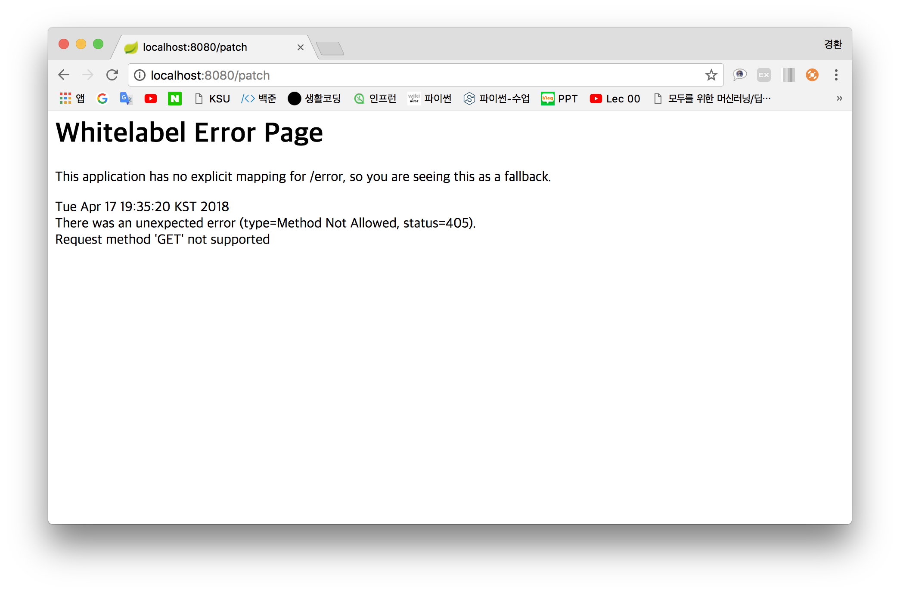
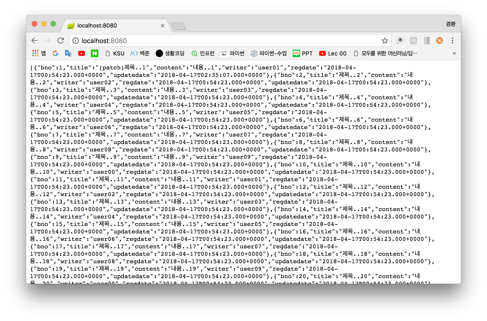

# CH.6(2018. 04. 17)
----

## 7주차

#### 1. Service 생성
    Package : src/main/java → new → Package → com.kyunghwan.services
    Class   : com.kyunghwan.services → new → Class → BoardService
~~~
@Service
public class BoardService {

	@Autowired
	BoardRepository boardRepository;
  public List<Board> getFindAll(){
		return boardRepository.findAll();
	}
}
~~~
#### 2. Repository findAll() 메서드 형변환
~~~
public interface BoardRepository extends CrudRepository<Board, Long>{

	List<Board> findAll();
}
~~~
#### 3. Controller 생성
~~~
@RestController
public class BoardControl {

	@Autowired
	BoardService boardService;

	@GetMapping("/")
	List<Board> listGetAll(){
		return boardService.getFindAll();
	}
}
~~~
#### 4. Title 가져오기
- BoardRepository : findByTitle() 오버라이딩
~~~
public interface BoardRepository extends CrudRepository<Board, Long>{

	List<Board> findAll();
	List<Board> findByTitle(String title);
}
~~~
- BoardService : getFindTitle() 생성
~~~
@Service
public class BoardService {

	@Autowired
	BoardRepository boardRepository;

	public List<Board> getFindAll(){
		return boardRepository.findAll();
	}

	public List<Board> getFindTitle(String title){
		return boardRepository.findByTitle(title);
	}
}
~~~
- BoardControl : listGetTitle() 생성
~~~
@RestController
public class BoardControl {

	@Autowired
	BoardService boardService;

	@GetMapping("/")
	List<Board> listGetAll(){
		return boardService.getFindAll();
	}

	@GetMapping("/title")
	List<Board> listGetTitle(){
		return boardService.getFindTitle("제목..177");
	}
}
~~~
#### 5. Content 가져오기
- BoardRepository : findByContent() 오버라이딩
~~~
public interface BoardRepository extends CrudRepository<Board, Long>{

	List<Board> findAll();
	List<Board> findByTitle(String title);
	List<Board> findByContent(String content);
}
~~~
- BoardService : getFindContent() 생성
~~~
@Service
public class BoardService {

	@Autowired
	BoardRepository boardRepository;

	public List<Board> getFindAll(){
		return boardRepository.findAll();
	}

	public List<Board> getFindTitle(String title){
		return boardRepository.findByTitle(title);
	}

	public List<Board> getFindContent(String content){
		return boardRepository.findByContent(content);
	}
}
~~~
- BoardControl : listGetContent() 생성
~~~
@RestController
public class BoardControl {

	@Autowired
	BoardService boardService;

	@PatchMapping("/patch")
	Board patchBoard() {
		return boardService.patchBoard(1L);
	}

	@GetMapping("/")
	List<Board> listGetAll(){
		return boardService.getFindAll();
	}

	@GetMapping("/title")
	List<Board> listGetTitle(){
		return boardService.getFindTitle("제목..177");
	}

	@GetMapping("/content")
	List<Board> listGetContent(){
		return boardService.getFindContent("내용..177");
	}
}
~~~
#### 6. like 구문처리
- 해당 writer에 해당하는 모든 정보를 읽어오기
- BoardRepository : findByWriterContaining 오버라이딩
~~~
public interface BoardRepository extends CrudRepository<Board, Long>{

	List<Board> findAll();
	List<Board> findByTitle(String title);
	List<Board> findByContent(String content);
	List<Board> findByWriterContaining(String writer);
}
~~~
- BoardService : getFindWriterContaining() 생성
~~~
@Service
public class BoardService {

	@Autowired
	BoardRepository boardRepository;

	public List<Board> getFindAll(){
		return boardRepository.findAll();
	}

	public List<Board> getFindTitle(String title){
		return boardRepository.findByTitle(title);
	}

	public List<Board> getFindContent(String content){
		return boardRepository.findByContent(content);
	}

	public List<Board> getFindWriterContaining(String writer){
		return boardRepository.findByWriterContaining(writer);
	}
}
~~~
- BoardControl : listGetWriter() 생성
~~~
@RestController
public class BoardControl {

	@Autowired
	BoardService boardService;

	@PatchMapping("/patch")
	Board patchBoard() {
		return boardService.patchBoard(1L);
	}

	@GetMapping("/")
	List<Board> listGetAll(){
		return boardService.getFindAll();
	}

	@GetMapping("/title")
	List<Board> listGetTitle(){
		return boardService.getFindTitle("제목..177");
	}

	@GetMapping("/content")
	List<Board> listGetContent(){
		return boardService.getFindContent("내용..177");
	}

	@GetMapping("/writer")
	List<Board> listGetWriter(){
		return boardService.getFindWriterContaining("05");
	}
}
~~~
#### 6. Update
    JPA : Update == put, patch
    1. 수정하고 싶은 객체를 찾는다.(수정하려는 객체를 찾고 객체의 존재 여부 파악 필수)
    2. 해당 객체를 새로운 객체로 복사 후 수정한다.
    3. 수정된 객체를 저장한다.
- boardService : patchBoard() 생성
~~~
@Service
public class BoardService {

	@Autowired
	BoardRepository boardRepository;

	public Board patchBoard(Long id) {		
		// 1. findByID
    // 해당 객체가 null 인지 아닌지 알 수 없으므로 Optional 로 감싼다.
		Optional<Board> board = boardRepository.findById(id);

		// 2. Patch
		// 반환 값이 존재
		if (board.isPresent()) {
			// Wrapper 해제
			Board patchBoard = board.get();
			patchBoard.setTitle("(patch)" + patchBoard.getTitle());

			// 3. 저장
			// patchBoard의 식별키가 살아있으면 데이터를 추가하지 않고 그 내용을 수정한다.
			// update를 할 때 식별키를 수정하면 insert가 되버린다.
			boardRepository.save(patchBoard);
		}

		// 반환 값이 존재하지 않으면 null 반환
		return null;
	}

	public List<Board> getFindAll(){
		return boardRepository.findAll();
	}

	public List<Board> getFindTitle(String title){
		return boardRepository.findByTitle(title);
	}

	public List<Board> getFindContent(String content){
		return boardRepository.findByContent(content);
	}

	public List<Board> getFindWriterContaining(String writer){
		return boardRepository.findByWriterContaining(writer);
	}
}
~~~
- BoardControl : patchBoard() 생성
~~~
@RestController
public class BoardControl {

	@Autowired
	BoardService boardService;

	@PatchMapping("/patch")
	Board patchBoard() {
		return boardService.patchBoard(1L);
	}

	@GetMapping("/")
	List<Board> listGetAll(){
		return boardService.getFindAll();
	}

	@GetMapping("/title")
	List<Board> listGetTitle(){
		return boardService.getFindTitle("제목..177");
	}

	@GetMapping("/content")
	List<Board> listGetContent(){
		return boardService.getFindContent("내용..177");
	}

	@GetMapping("/writer")
	List<Board> listGetWriter(){
		return boardService.getFindWriterContaining("05");
	}
}
~~~
- 실행결과 : 오류

- 브라우저는 get방식 이외의 것을 허용하지 않기에 오류 발생
- Postman을 이용하여 리턴 값 확인가능
- 전체 목록 실행

----
## etc
- where 절을 한글로 풀고 find 구하기
- find = 쿼리
- SELECT * / FROM Board(테이블) / while = "제목 177" <=> findByTitle("제목 177")
- Collection <T> findBy + 속성 이름(속성 타입)
- Repository(조작만 수행) save() = insert() : find 쿼리 삽입
- Service(Repository 와 연결) → Controller와 연결
- Entity → DB table / Repo → 연산자
- Repository → Service → Controller
- find
  - findAll
  - findBy컬럼명(where 절)
  - findBy컬럼명+Containing
- JPA → update(x) → What Update?(put, patch)
- HTTP
  - get : Read
  - post : Create
  - put : Update
  - patch : Update
- 1.4, 2.2(CRUD, D제외), 3.1(3.1.1)
