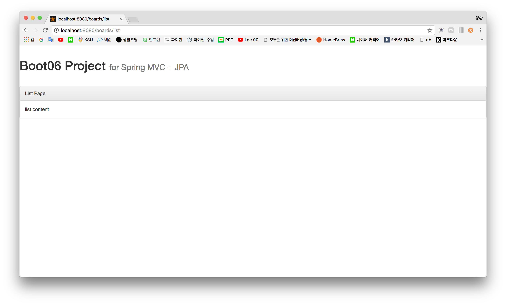

# Ch.7(2018. 05. 08)

## 8주차(템플릿 엔진 세팅, 사용법)

#### 1. 프로젝트 생성(6장)
    File → New → Spring Starter Project
- Name : boot06
- Group : com.kyunghwan
- Check : DevTools, JPA, H2, Thymeleaf(Template Engine), Web
  1. DevTools : 서버를 자동으로 리플레쉬
  2. JPA : 데이터베이스에 접근하기 위하여 사용
  3. H2 : 내장 메모리 데이터베이스
  4. Thymeleaf : 템플릿 엔진(html기반)
  5. Web : 웹에서 필요한 각종 도구사용

#### 2. 라이브러리 추가([링크](https://mvnrepository.com/artifact/nz.net.ultraq.thymeleaf/thymeleaf-layout-dialect/2.3.0))

    boot06 → pom.xml → pom.xml → dependencies
~~~
<dependency>
    <groupId>nz.net.ultraq.thymeleaf</groupId>
    <artifactId>thymeleaf-layout-dialect</artifactId>
    <version>2.3.0</version>
</dependency>
~~~

#### 3. 레이아웃 폴더 생성([링크](http://www.namgarambooks.co.kr/entry/%EC%8A%A4%ED%83%80%ED%8A%B8-%EC%8A%A4%ED%94%84%EB%A7%81-%EB%B6%80%ED%8A%B8-%EC%86%8C%EC%8A%A4%EC%BD%94%EB%93%9C-%EC%98%88%EC%A0%9C?category=584782))
       layout : boot06 → src/main/resources/templates → New → Folder → layout
       static : boot06 → src/main/resources/static → boot05_static paste
    templates : boot06 → src/main/resources/static → boot05_templates_layout paste

#### 4. 부트스트랩 추가([링크](http://bootstrapk.com/getting-started/))
    boot06 → src/main/resources → templates → layout → layout1.html
- 추가(head)
~~~
<link rel="stylesheet" href="https://maxcdn.bootstrapcdn.com/bootstrap/3.3.2/css/bootstrap.min.css">

<link rel="stylesheet" href="https://maxcdn.bootstrapcdn.com/bootstrap/3.3.2/css/bootstrap-theme.min.css">

~~~
- 추가(body)
~~~

  <h1>
    Boot06 Project <small> for Spring MVC + JPA</small>
  </h1>

~~~
- 삭제
~~~

~~~

#### 5. Controller 생성
    package : new → Package → boot06 → src/main/java → com.kyunghwan.board
      class : new → Class → BoardController
- BoardController 내용추가
~~~
package com.kyunghwan.board;

import org.springframework.stereotype.Controller;
import org.springframework.web.bind.annotation.GetMapping;
import org.springframework.web.bind.annotation.RequestMapping;

@Controller
@RequestMapping("/boards/")
public class BoardController {

	@GetMapping("/list")
	public void list() {
		System.out.println("called list()");
	}
}
~~~

#### 6. list.html 생성
    boards : src/main/resources → templates → new → Folder → boards
    list   : boards → list.html
~~~
<html xmlns:th="http://www.thymeleaf.org"
	xmlns:layout="http://www.ultraq.net.nz/thymeleaf/layout"
	layout:decorate="~{/layout/layout1}">

	
List Page

	

		list content
	

<th:block layout:fragment="script">
	
</th:block>
~~~

#### 7. 실행
    boot06 → Run As → Spring Boot App

#### 8. 5, 6번 해석
1. 사용자가 Get명령을 보낸다(/board/list)
2. 제일 먼저 BoardController로 도착한다
3. /board/list를 맵핑한다.
    - 클래스 명령 위에 올라오는 것은 /boards/ '/' 추가하여 큰 기준으로 본다.
    - boards로 먼저 이동 후 list로 이동한다.
4. void list() 메서드가 리턴값이 없지만 @Controller 어노테이션에 의하여 html 파일을 프레임 워크가 찾는다.(관례상 GetMapping의 연결하는 링크와 메서드 이름을 동일하게 작성하는게 바람직하다.)
    - ex) a/b/c/d → a폴더 안 b폴더 안 c폴더 안 d.html
    - board/list → board폴더 안 list.html
5. resources로 이동하여 templates 폴더를 찾은 후(board/list.html) list.html을 연다.(url 경로 지정에 주의가 필요)
6. list.html(화면 출력) - html을 이용한 템플릿 엔진 문법(html과 동일하게 보이게 하지만 html은 아니다.)
7. layout을 최상단에 놔두고 컨텐츠 부분에 list.html을 주입하여 html을 보이게 한다.(헤더의 중복을 막기 위하여 템플릿 엔진이 도와준다.)
    - layout:fragment="content" : 템플릿 엔진 문법

----

## etc
- URI, URL 용어정리
- HTML5의 3요소
  1. HTML(Model)
  2. CSS3(View)
      - 부트스트랩
      - 벌마
  3. JS(ES6)(Controller)
      - jQuery
      - React
      - view.JS
      - Angular
- 프로젝트에 디자인이 상승 요인은 되나 하향 요인은 되지 않음
- Template Engine : 자바 객체를 화면에 생성하는 것
- HTML
  - 웹 브라우저에서 html을 렌더링 할 때 body 부터 렌더링
  - 화면에 tag부터 생성
  - 자바 스크립트 전체 내용을 메모리로 호출
  - header를 붙인다
      - css공간(위치) 조정(margin, padding)
      - css색깔 조정
      - 자바스크립트 적용
