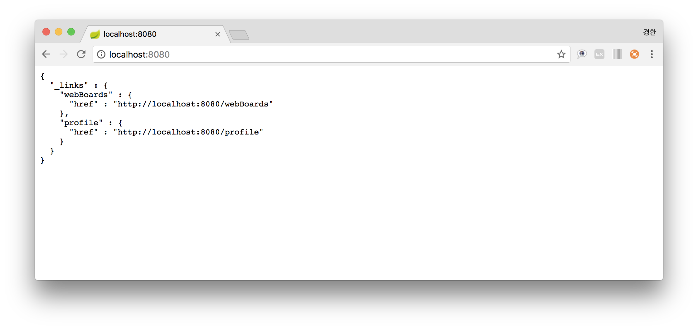
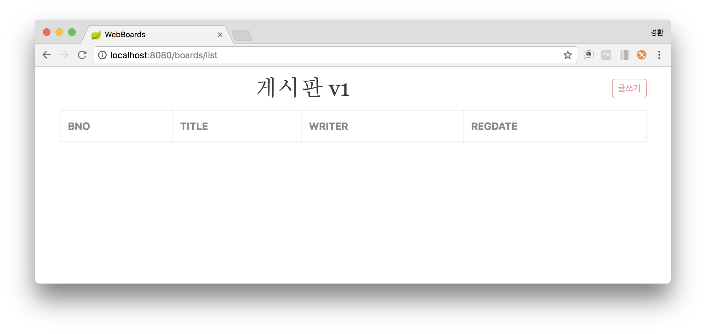
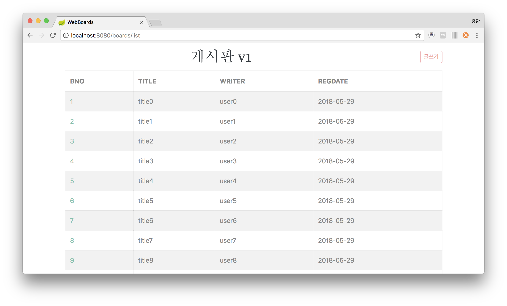
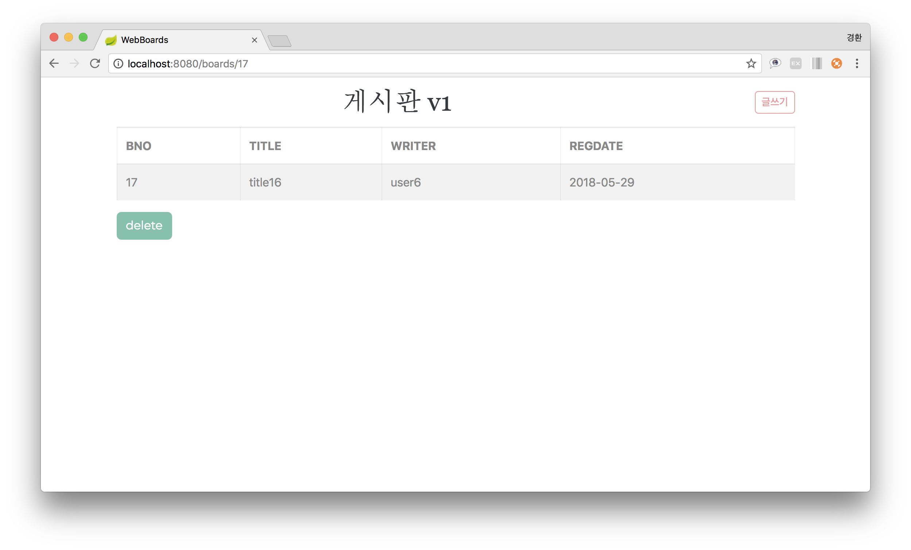
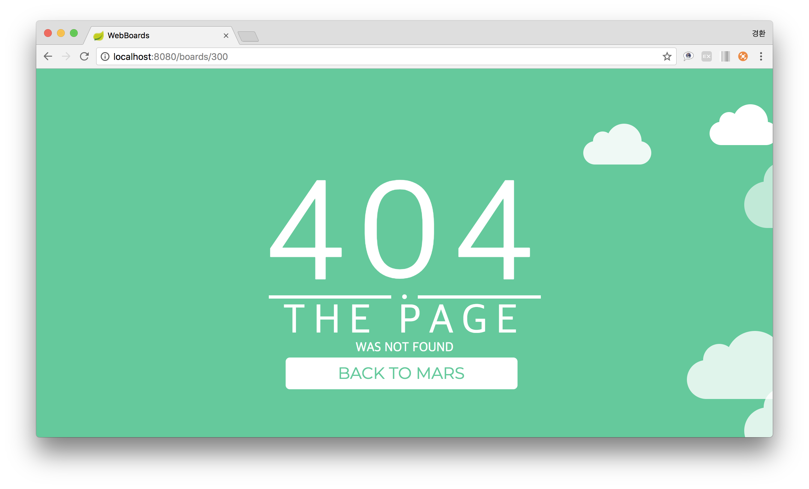
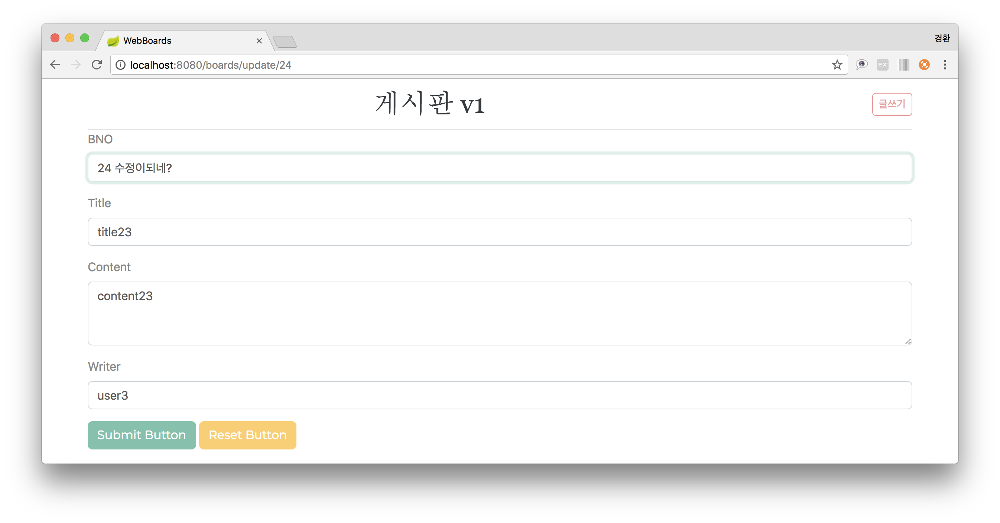
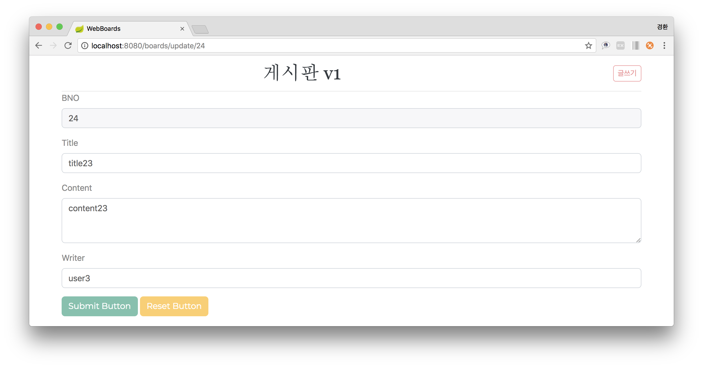
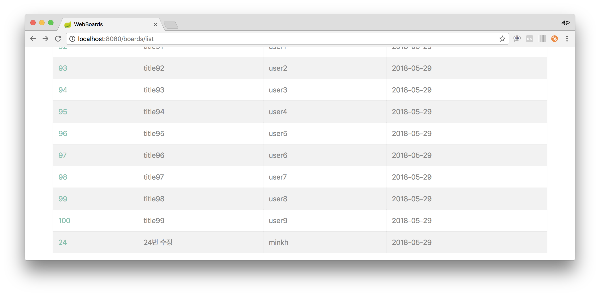

# CH.9(2018. 05. 29)

## 10주차
- 게시판 업데이트

#### 1. 다운로드([링크](https://github.com/sigmadream/ks-springboot))
    ks-springboot → webBoard 폴더생성
 

#### 2. webBoard 불러오기 & 실행
    1) File → import → Maven → Existing Maven Projects
    2) Root Directory → Browse → webBoard → Finish
    3) Run As → Spring boot App
- localhost:8080
  
- localhost:8080/boards/list
  
 

#### 3. 전체 데이터 출력을 위한 함수생성
    board → src/main/java → kr.ac.ks → WebBoardRepository
- 현재 DB 테이블의 내용 전부 가지고오기 + 오름차순 정렬(findAllBy + OrderByAsc)
~~~
package kr.ac.ks.board;
import java.util.List;
import org.springframework.data.repository.CrudRepository;

public interface WebBoardRepository extends CrudRepository<WebBoard, Long> {
	List<WebBoard> findAllByOrderByUpdatedateAsc();
}
~~~
 

#### 4. 데이터 출력(/boards/list)
    board → src/main/java → kr.ac.ks.board → WebBoardController
- 모델에 속성추가(이름 : result, 내용 : repo.~)
- list.html의 result에 출력
~~~
@GetMapping("/list")
public void list(Model model){
  model.addAttribute("result", repo.findAllByOrderByUpdatedateAsc());
}
~~~
- localhost:8080/boards/list
  
 

#### 5. 게시물 삭제하기
~~~
@GetMapping("/delete/{bno}")
public String delete(@PathVariable("bno") long bno, RedirectAttributes rttr ){
  repo.findById(bno).orElseThrow(null); // DB에 bno가 있는지 확인 없으면 나가기
  repo.deleteById(bno); // 존재하면 삭제
  return "redirect:/boards/list"; // 삭제 후 List 페이지로 되돌아오기
}
~~~
1. 삭제 하고싶은 bno가 존재하는지 확인
2. 존재 X → 빠져나가기 / 존재 O → 삭제
3. 삭제 후 원래 페이지(List)로 돌아오기
 

#### 6. 해당 게시물 클릭시 나타나는 화면
~~~
@GetMapping("/{bno}") // 클릭시 출력되는 화면 (boards/n)
public String view(@PathVariable("bno") long bno, Model model){
  if (repo.findById(bno).isPresent()) { (1) // bno가 존재하면 출력
    model.addAttribute("result", repo.findById(bno).get()); (2)
  } else { // 없으면 에러 출력
    return "errors/404"; (3)
  }
  return "boards/view";
}
~~~
1. 해당 bno가 있는지 확인 (1)
2. 존재 O → 화면출력 (2) / 존재 X → 오류 화면 출력 (3)
- 존재 O

- 존재 X

 

#### 7. Update 설계
- Input(11번 + 수정할 데이터) → [?] → Output(11번)
  1. 11번 수정하려면? - get(HTML - form태그 이용 내용수정)
  2. 11번을 가져오기 - ById?
  3. 11번을 수정하기 - 11번.set(수정.get)
  4. 수정된 11번을 저장하기 - save?

##### 1. form 만들기
~~~
@GetMapping("/update/{bno}")
public String updateGet(@PathVariable("bno") long bno, Model model) {
  // update번호 를 입력할 시 해당 화면을 먼저 출력
  // findById는 optional 이기 때문에.get()으로 객체를 불러온다.
  model.addAttribute("result", repo.findById(bno).get());
  return "boards/update";
}
~~~
##### 2. update.html 생성
~~~
register.html copy → update.html
~~~
##### 3. controller 속성 값 변경
 - result → vo
~~~
@GetMapping("/update/{bno}")
public String updateGet(@PathVariable("bno") long bno, Model model) {
  // update번호 를 입력할 시 해당 화면을 먼저 출력
  // findById는 optional 이기 때문에.get()으로 객체를 불러온다.
  model.addAttribute("vo", repo.findById(bno).get());
  return "boards/update";
}
~~~
##### 4. 수정번호에 해당하는 창 출력
~~~
@PostMapping("/update/{bno}")
public String updatePOST(@ModelAttribute("vo") WebBoard vo) {
  repo.save(vo);
  return "redirect:/boars/list";
}
~~~
- update.html 수정
~~~
<form th:action="@{/boards/update}" method="post">
~~~

##### 5. id(primary key) 를 함께 저장 & bno 읽기전용 수정
~~~

    <label>BNO</label>
    <input readonly="readonly" class="form-control" name="bno" th:value="${vo.bno}" placeholder="Title text here." />

~~~

##### 6. 이 전의 내용을 읽어 온 후 수정한 내용을 저장
~~~
@PostMapping("/update")
public String updatePOST(@ModelAttribute("vo") WebBoard vo) {
  WebBoard webBoard = repo.findById(vo.getBno()).get();
  webBoard.setTitle(vo.getTitle());
  webBoard.setContent(vo.getContent());
  webBoard.setWriter(vo.getWriter());
  repo.save(webBoard);
  return "redirect:/boards/list";
}
~~~
##### 7. 수정 후 실행

## etc
1. JSON을 이용하여 html 생성
2. jQuery 이용(inner HTML)
3. React.Js 이용(SPA)(Web MVC → React 변형)
4. jQuery를 이용한 댓글을 달 수 있는 페이지 생성
5. Front-End : Rest Controller / Back-End : 캐시

- 4월 : Rest Controller
- 5월 : MVC
- 6월 : term Project + (4월 + 5월) → jQuery
- 기말고사

1. 데이터베이스 자료 들고오기
2. 자료가공
3. 자료출력

- Input
- Processing
- Output
